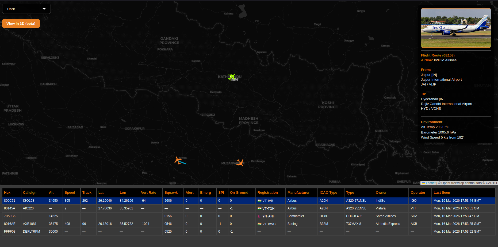
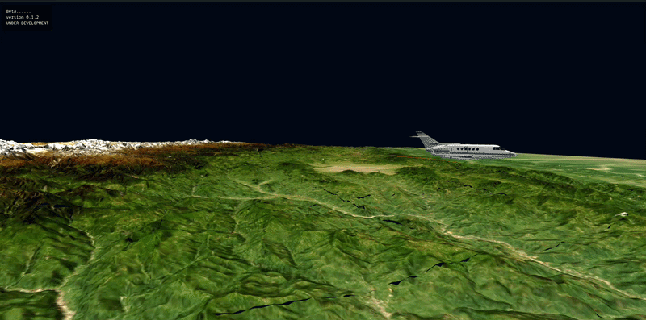

# ADS-B Plane Tracker and Decoding Framework

ADS-B decoder and framework surrounding tracking aircraft and their visualizations.

**Live Website**  
https://plane.kushal-kc.com.np

Currently the website visualizes aircraft flying around the **Kathmandu Valley**.  
A **3D Beta visualization** has also been added.

---

## Overview

Compared to other plane tracking services, this website focuses on showing **aircraft detected locally**.  
This allows us to see planes even when **position data is not available** when some planes transmit altitude,speed data.

3D tracking is still in **beta**.

### Website View

---

## 3D Visualization (Beta)

A **3D aircraft view** has been added to the project.

This feature is still under **beta** and **not fully optimized yet**.  
Future updates will improve performance and rendering quality.

### 3D Aircraft Demo

---

## MLAT and Decoder Development

Some components of the system are still under development:

- **MLAT** – Under development. Contact if you are willing to host a receiver around Kathmandu Valley.
- **ADS-B Decoder** – Under development.

---

